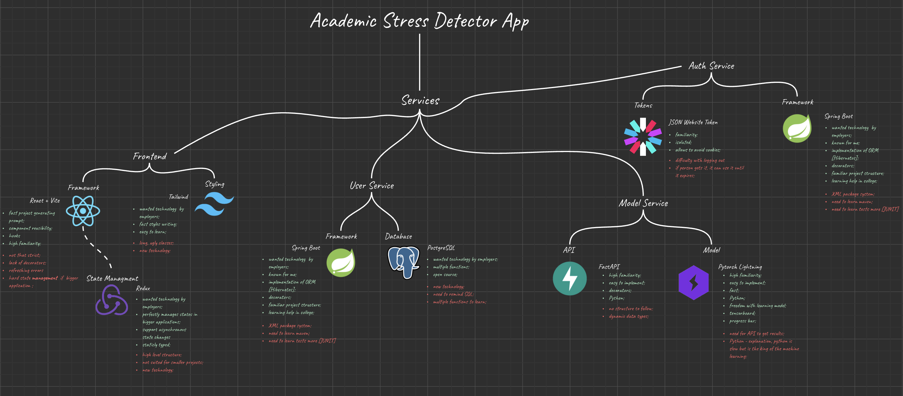

# 🔐 Academic Stress Detector - Auth Service

## 💡 Overview

Auth Service of this application was built using Spring Boot and Maven. PosgreSQL was choosen as the shared database across auth and user services. This micro-service purpose is to authorize and register new users. For this goal application uses JSON Website Tokens, Roles Authorization Mechanics and password one direction hashing.



## 🪾 Branches
* `/auth/validate` validate branch

* `/auth/register` register branch
    ```
    body: {
        username: string
        email: string
        password: string
    }
    ```

* `/auth/login` login branch
    ```
    body: {
        email: string
        password: string
    }
    ```


## 🗒️ Features
* JWT authorization method;
* PostgreSQL databse;
* Bcrypt hashing;
* CORS:
* Role authentication;

## ⚙️ Command Tools

To work with this project locally or in a containerized environment, use the following commands:
```bash
./mvnw spring-boot:run # to run project

./mvnw clean # clean logs

openssl rand -base64 64 # generates random base64 string

export {PROPERTY_NAME}={VALUE} # set env variable 
````

## 🧠 Tech Stack
<p align="center">
  <a href="https://skillicons.dev">
    
  </a>
</p>